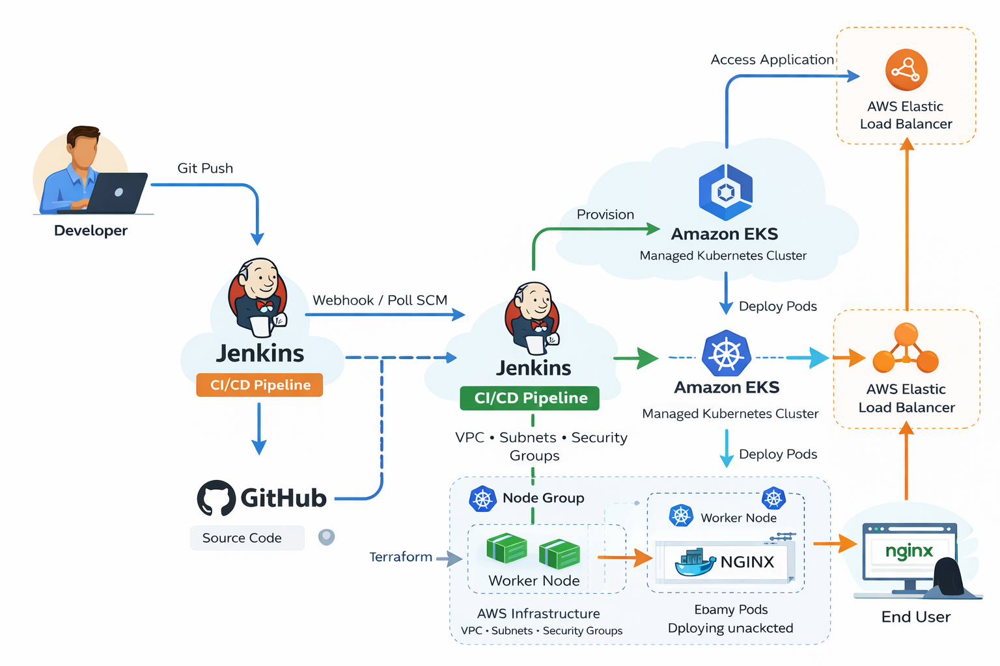
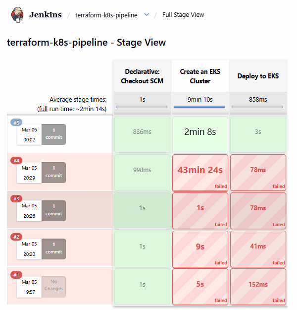
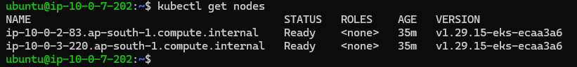
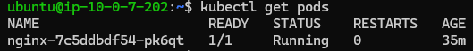
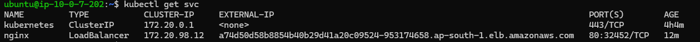
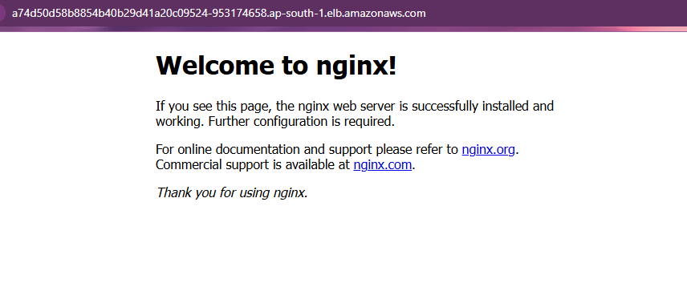

## 🚀 Terraform + Jenkins + Kubernetes (EKS) CI/CD Pipeline


---

# 📌 Project Overview

This project demonstrates a Kubernetes application using Jenkins for CI-CD pipeline, EKS for automated cluster configuration, and terraform for provisioning of the infrastructure.

## ⭐ Project Highlights

- Automated CI/CD pipeline using **Jenkins**
- Infrastructure provisioning using **Terraform**
- Kubernetes deployment on **AWS EKS**
- Application exposed using **AWS LoadBalancer**
- Fully automated DevOps workflow from **GitHub → Production**
    


---

## 📑 Table of Contents

- [Project Overview](#project-overview)
- [Architecture](#architecture)
- [Tech Stack](#tech-stack)
- [Project Structure](#project-structure)
- [CI/CD Pipeline Flow](#cicd-pipeline-flow)
- [Jenkins Pipeline](#jenkins-pipeline)
- [Kubernetes Deployment](#kubernetes-deployment)
- [Application Output](#application-output)
- [Key Learnings](#key-learnings)
- [Clean Up](#clean-up)

---

# 🏗 Architecture



```
Developer
    │
    │ Git Push
    ▼
GitHub Repository
    │
    ▼
Jenkins CI/CD Pipeline
    │
    │ Terraform
    ▼
AWS Infrastructure
(VPC + Subnets + Security Groups)
    │
    ▼
Amazon EKS Cluster
    │
    ▼
Kubernetes Deployment
(Nginx Pod)
    │
    ▼
Kubernetes Service
(Type: LoadBalancer)
    │
    ▼
AWS Elastic LoadBalancer
    │
    ▼
Internet
    │
    ▼
End User
```

---

# ⚙️ Tech Stack

| Tool       | Purpose                    |
| ---------- | -------------------------- |
| AWS        | Cloud infrastructure       |
| Terraform  | Infrastructure as Code     |
| Jenkins    | CI/CD pipeline             |
| Kubernetes | Container orchestration    |
| Amazon EKS | Managed Kubernetes cluster |
| GitHub     | Source code management     |
| Nginx      | Sample application         |

---

# 📂 Project Structure

```
terraform-k8s-jenkins-project
│
├── Jenkinsfile
├── provider.tf
├── variables.tf
├── terraform.tfvars
├── vpc.tf
├── server.tf
├── route.tf
├── security.tf
├── backend.tf
│
├── eks-cluster/
│
├── screenshots/
│   ├── jenkins-pipeline-success.png
│   ├── terraform-apply.png
│   ├── k8s-nodes.png
│   ├── k8s-pods.png
│   ├── k8s-service.png
│   └── nginx-app.png
│
└── README.md
```

---

# 🔄 CI/CD Pipeline Flow

### 1️⃣ Developer pushes code to GitHub

Developer pushes code to GitHub.

```
git push origin main
```

### 2️⃣ Jenkins pipeline is triggered

Jenkins automatically triggers the pipeline.

Pipeline stages:

```
Checkout SCM
Create EKS Cluster
Deploy to Kubernetes
```

### 3️⃣ Terraform provisions AWS infrastructure

Terraform provisions AWS resources:

* VPC
* Subnets
* Internet Gateway
* Route Tables
* Security Groups
* EC2 Instance (Jenkins Server)
* EKS Cluster
* Node Groups

Example command:

```
terraform init
terraform plan
terraform apply
```

###4️⃣ EKS cluster is created

### 5️⃣ Kubernetes Deployment runs

Application deployed to Kubernetes.

```
kubectl get nodes
kubectl get pods
kubectl get svc
```
6️⃣ Nginx application is deployed

7️⃣ AWS LoadBalancer exposes the application

---

### 📸 Project Screenshots
# 📊 Jenkins Pipeline Execution



---

# ☸ Kubernetes Cluster

### Nodes



---

### Pods



---

### Services



---

# 🌐 Application Output

The Nginx application is exposed via AWS LoadBalancer.



---

## 🧩 Skills Demonstrated

- Infrastructure as Code (Terraform)
- CI/CD Pipeline Automation (Jenkins)
- Kubernetes Deployment & Management
- AWS Cloud Infrastructure
- DevOps Workflow Automation

---

# 🧠 Key Learnings

This project demonstrates:

* Infrastructure provisioning with **Terraform**
* Automated deployment with **Jenkins CI/CD**
* Running applications of Kubernetes deployment on **AWS EKS**
* Managing workloads with **Kubernetes**
* Exposing services using **AWS LoadBalancer**
* Troubleshooting **subnet tagging issues for ELB**

---

# 🧹 Clean Up

To avoid AWS billing, destroy the infrastructure after testing.

```
terraform destroy
```

---

# 👨‍💻 Author

**Faizan**

DevOps & Cloud Enthusiast

